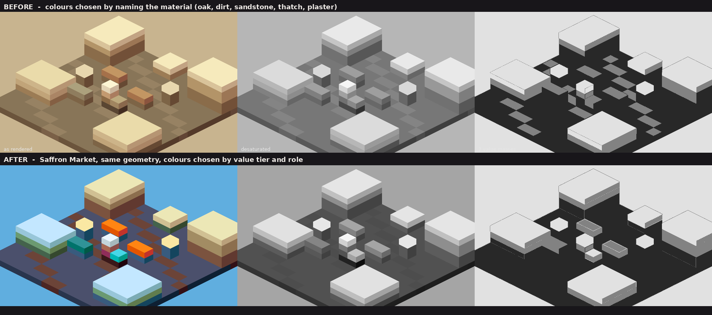
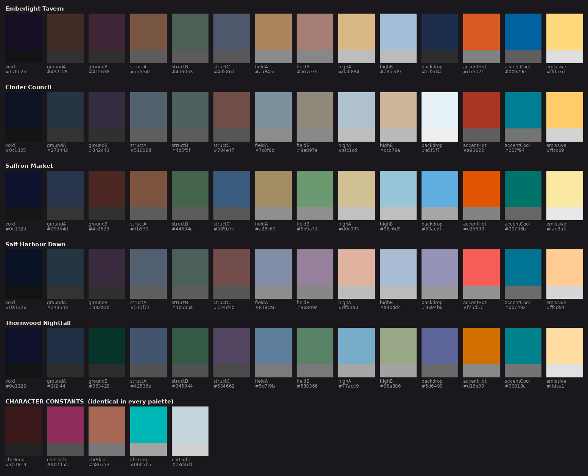
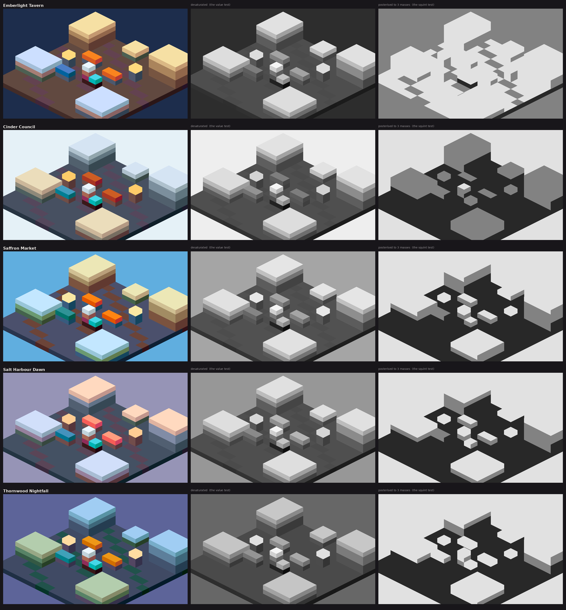

# Colour for a flat-shaded voxel world

**A working study, with palettes, for a three.js scene that reads brown-and-cream.**
Compiled 21 August 2026.

---

## What's in this folder

| File | What it is |
|---|---|
| `colour-study.md` | This document. |
| `palettes.json` | Five palettes + character constants, with hex, OKLab L, Rec.709 luminance and greyscale equivalent for every swatch. |
| `palettes.ts` | The same, as a TypeScript module you can import into three.js today. |
| `swatches.png` | All five palettes as swatches, each with its greyscale value strip directly underneath. |
| `value-proof.png` | The same isometric voxel scene rendered in all five palettes, each shown as-rendered / desaturated / posterised to three masses. |
| `before-after.png` | A reproduction of the brown-and-cream failure next to the same geometry in Saffron Market. |
| `diagnose.py` | **Run this on a screenshot of the actual scene before changing anything.** It tells you whether you have a hue problem or a value problem. They need opposite fixes. Requires `numpy` and `pillow`. |
| `scene-*.png` | The five proof renders, plus a `-diagnosis` triptych for each (original / desaturated / three value masses). |

`palettes.json` and `palettes.ts` are generated artefacts, not hand-edited — the generator (`build_palettes.py`), the figure scripts (`render_proof.py`, `make_badcase.py`), the verification log (`report.txt`) and the two spread experiments cited in §4.5 (`_exp.py`, `_exp2.py`) are not checked in here. Ask if you want them; they're small and self-contained, and the generator is what you'd edit to author a sixth palette.

**Quick start:** `python3 diagnose.py path/to/frame.png` for the diagnosis, `import { PALETTES } from './palettes'` for the colours, §4.5 for how the ladder interacts with an existing scene, §6 for the ordered checklist.

---

## 0. The diagnosis, and an inconvenient result

You've been told — and this document will spend a whole section agreeing — that value beats hue. So the expected finding here was "your problem is value structure, not hue variety."

I reproduced the failure to check. `make_badcase.py` builds a small isometric voxel town and colours it the way almost everyone colours a voxel scene: by **naming the material and eyedropping a plausible swatch.** Oak. Dirt. Sandstone. Thatch. Clay. Plaster. No value plan, no hue plan, just six sensible material colours. It produces the brown-and-cream frame exactly.

Then I measured it (`diagnose.py`):

```
=== scene-BEFORE-brown-and-cream.png
 1 value spread  (P95-P05 OKLab L) : 0.472   want > 0.45
 2 value separation (min gap between the 4 mass centres)
                                   : 0.099   want > 0.060
   mass centres L = 0.54, 0.64, 0.78, 0.91   area share = 29%, 13%, 45%, 13%
 3 hue convergence (chroma-weighted): 0.99      want < 0.55
   mean hue   79.6 deg   share of chroma within +-30 deg: 100%   want < 60%
 4 chroma: mean 0.056  P99.5 0.086  area above C=0.11: 0.0%
                                   want mean < 0.075, P99.5 > 0.13, hot area 1-6%
 -> HUE. 100% of the frame's chroma sits in a 60-deg arc around 80 deg, and
    there is no accent breaking out of it. Introduce a counter-temperature mass.
    | NO ACCENT. Nothing in frame is saturated enough to be a focal point.
```

Metrics 1 and 2 pass. Metrics 3 and 4 fail, and not marginally.



*Top: the reproduced failure. Bottom: identical geometry, Saffron Market palette. Each row is as-rendered / desaturated / posterised to three masses. `before-after.png`*

**The value structure passes.** Look at the top row: the desaturated BEFORE frame is perfectly legible. Buildings separate from ground, roofs separate from walls, the character reads. The greyscale is *fine*.

What fails is hue and chroma, and it fails absolutely:

- **100% of the frame's chroma lies inside a 60° arc.** Not "mostly" — all of it. Every material name in the fantasy-village vocabulary lands between hue 20° and 80° in OKLCH. Oak, dirt, sandstone, thatch, clay, plaster, straw, hemp, leather, bread, candlelight. They are all the same hue. This is not a coincidence you fell into; it is a property of the word list.
- **0.0% of the frame is above chroma 0.11.** Nothing is saturated enough to be a focal point. "Brown" and "cream" are, respectively, low-chroma dark orange and low-chroma light orange. They are two ends of one ramp.

So the honest diagnosis for your specific symptom is:

> **Hue convergence with no accent, on top of a value structure that is probably already adequate.** The palette is one ramp. It has no counter-temperature and no saturated mass anywhere.

This matters practically, because the two failures have opposite fixes and you have a week:

- If it were a **value** failure, the fix is to re-tier every block colour and accept that hues barely matter. Expensive, slow, and it changes every asset.
- Because it's a **hue/chroma** failure, the fix is far cheaper: introduce one counter-temperature mass, desaturate the architecture slightly, and add a strictly-budgeted saturated accent. That's a palette swap, not a rebuild.

**Do not take my word for it.** Run `python3 diagnose.py your-screenshot.png` on three or four real frames from your scene — an interior, an exterior, a wide shot and a close shot — before you touch anything. If metric 2 comes back under 0.06 you *do* have a value problem as well, and Section 2 is where you start. If it comes back clean and metric 3 is over 0.55, go straight to Section 4 and swap the palette.

Two caveats on the tool, stated plainly:

- The thresholds are mine, calibrated against the five palettes in this document plus the deliberately-bad case. They are a rule of thumb, not a standard.
- Metric 2 runs k-means with k=4. On a scene that genuinely has three masses it will split one of them and report a small gap. Read the printed mass centres, not just the number. A tight pair at the *top* of the range almost always means your sky and your lit roof planes are the same value — a real and common defect. It caught exactly that in two of my own palettes while I was building them, and I fixed both.

---

## 1. Colour theory as game art directors actually use it

### 1.1 The colour script

The colour script is the single most transferable practice here, and it exists for production reasons rather than aesthetic ones. Ralph Eggleston developed his version on *FernGully* (1992) because the film had fourteen producers and work being done in different parts of the world:

> "in order to convey the entire sequence in one fell swoop… that was the only way I could do it, it was to do these little strips and kind of just block it out. I kind of hit my high point and my low point, what's the story, and what are the characters and contrast and color and where did I want that to go… Once I did that, I was able to kind of take the layout drawings, give a chunk of the color script to the painter and with all the background paintings they knew exactly what to do within that."
> — Ralph Eggleston, quoted in [Cartoon Brew](https://www.cartoonbrew.com/rip/ralph-eggleston-a-cornerstone-of-pixars-visual-style-dies-at-56-220781.html)

He brought it to Pixar in 1993 and made the first *Toy Story* colour script in pastel. Amid Amidi's definition is the one worth memorising:

> "It's not about making a single pretty piece of art; the color script evolves throughout the early stages of the film, hand in hand with story development."
> — [Animated Views interview](https://animatedviews.com/2011/the-art-of-pixar-the-complete-color-scripts-and-select-art-from-25-years-of-animation-an-interview-with-author-amid-amidi/)

**In games this is done by printing the frames and putting them on a wall.** Literally. Ken Wong on *Monument Valley*:

> "We printed out every screen of the game and pasted them all on a wall so we could see the game as a colour script, and made modifications based on that. Our shaders system enabled us to apply colour directly instead of creating a true lighting system."
> — [Computer Arts / Creative Bloq](https://www.creativebloq.com/computer-arts/making-monument-valley-71412213)

That second sentence is your exact situation. Monument Valley didn't light its world; it assigned colour to it. So do you.

The best-documented game colour-script process is Jemma Salume's on *Beast Breaker*. Her second pass is where the useful part happens — the script gets **retro-fitted to gameplay legibility**, and that retro-fit is what creates a colour vocabulary:

> "The home farm contains a lot of yellow, so yellow became the main 'you want this, it's safe' color throughout the game. White showed up well and looked pleasing against all backgrounds, so Skipper became a white mouse. Magenta also showed up well but clashed with everything, so it became the color of the beast cores and corruption… Once decisions like that crystallized, I went back to edit the color script to reflect the 'color vocabulary' we were building."
> — [Game Developer](https://www.gamedeveloper.com/art/how-color-scripting-conveyed-the-emotional-arcs-of-beast-breaker)

Note the reasoning: *white showed up well, so the hero is white. Magenta clashed with everything, so it means corruption.* The colour was chosen by testing it against the environments, then given a meaning. That's backwards from how most people do it and it's the right way round.

**For a 60-second demo, your colour script is 8–12 stills.** Not storyboards — just the actual frames you intend to shoot, laid out in order at thumbnail size. If two adjacent shots have the same dominant colour, one of them is wasted screen time.

Matt Nava did precisely this kind of edit on *Journey*, late:

> "My concepts were tinted with cool colors. Later in development I switched it to warm colors, to improve the bigger picture color script of the game. There needed to be a sense of warmth before you head to the cold mountain."

and, on withholding a colour so it can pay off later:

> "I wanted to save bright blue skies for the ending of the game as a reward, so I put a green sky in this earlier scene."
> — [Matt Nava, Journey 10th anniversary retrospective](https://mattnava.com/Journey-10th-Anniversary-Behind-the-Scenes-Retrospective)

Sixty seconds is enough time to do that once. Pick one colour you never show until the final ten seconds.

### 1.2 Local colour versus lighting colour

Realistic rendering computes `lit = albedo × light`. Stylised rendering usually doesn't, and the most explicit statement of that in the literature is Arc System Works' *Guilty Gear Xrd* talk:

> "Color selection in anime is vital. Every color is carefully chosen to express not just the material, but the character it self. **It is not as simple as just multiplying the shaded area with an ambient color.**"
>
> "we used two textures. The base texture defines the color of the surface when it's lit. While the Tint texture defines how dark it gets when shaded. Multiplying the two textures, we get the shaded color. This way, **the choice of color is completely up to the artist**."
>
> "both of these textures are just square areas consisting of single colors… we simply use them as color lookups, and do not draw-in any details."
> — Junya C. Motomura, [GDC 2015 speaker notes (PDF)](https://www.ggxrd.com/Motomura_Junya_GuiltyGearXrd.pdf)

They also note *why* the shadow colour is a separate authored decision: "the shaded color often expresses how solid that material is… shades on human skin get a red tint because of the flesh under it."

His thesis, which is the whole argument for this document: *"while the math within the shader is always 'correct', 'correct' is just not good enough."*

**Application to you:** every voxel block should be authored as a *pair* — its lit colour and its shadow colour — not as one colour that the renderer darkens. Section 5 shows how to get that almost for free from face normals.

### 1.3 Warm–cool as structure

Valve's *Team Fortress 2* paper distilled five rules from Leyendecker, Cornwell and Rockwell. Verbatim:

> "• Shading obeys a warm-to-cool hue shift. **Shadows go to cool, not black.** • **Saturation increases at the terminator** with respect to a given light source. The terminator is often reddened. • High frequency detail is omitted where possible • On characters, interior details such as clothing folds are chosen to echo silhouette shapes • **Silhouettes are emphasized with rim highlights rather than dark outlines**"
> — Mitchell, Francke & Eng, [Illustrative Rendering in Team Fortress 2, NPAR 2007 (PDF)](https://steamcdn-a.akamaihd.net/apps/valve/2007/NPAR07_IllustrativeRenderingInTeamFortress2.pdf)

The academic ancestor is Gooch shading (SIGGRAPH 1998), which replaced Phong's light-to-dark with a **cool-to-warm hue shift**, explicitly so that "extreme lights and darks are reserved for edge lines and highlights, resulting in a clearer perception of 3D object structure under difficult lighting situations." Valve says outright that they "employ a similar system."

TF2 also uses temperature as *team identity*, which is temperature-as-wayfinding: "the red team's base tends to use warm colors, natural materials and angular geometry, the blue team's base is composed of cool colors, industrial materials and orthogonal forms."

**A gap I should flag honestly:** I looked for a first-party developer statement framing warm/cool as a *depth-separation* device — "we pushed backgrounds cool to separate the player" — and did not find one. What exists on that specific claim is art-education content, not production sources. The defensible citation chain for temperature-as-structure is Gooch 1998 → TF2 2007 → the Mirror's Edge palette below, plus the classical atmospheric-perspective literature. Treat "cool recedes" as a well-founded convention rather than a documented studio practice.

### 1.4 Accent colour and attention

*Mirror's Edge* is the cleanest published account of a controlled field with a reserved accent. Art director Johannes Söderqvist:

> "The palette we used is fairly controlled and specific. **The blue skies and shadows together with the white geometry create a minty cool look and all the other colors we used were chosen as a contrast to this**, mainly warm autumn hues. Green was practically banned from exteriors and instead used in a lot of the interiors."
>
> "Red looks so awesome against white and it is a very strong vibrant color in a classic sense unlike hot pink, orange or turquoise."
> — [Animation World Network, 2009](https://www.awn.com/vfxworld/mirrors-edge-leap-faith)

Two things to steal: the field is defined *first* and everything else is defined *as contrast to it*; and a hue is banned from one context and reserved for another.

Riot's public VFX style guide is the most mechanical version of this idea I found. It divides the screen into **reserved value bands and reserved saturation bands per discipline** — UI, character, environment and VFX each get a non-overlapping range — and states rules like:

> "HIGHER VALUE RANGE DRAWS MORE FOCUS / CONTRAST CAN CREATE A CLEAR AREA OF EFFECT / AVOID USING 100% OR 0% VALUES, AS IT CAN BE CONFUSED FOR THE GAME ENVIRONMENT OR UI"
>
> "A champion's VFX has a higher and wider range of value and saturation range than its model."
> — Riot Jino, [VFX Style Guide (PDF)](https://nexus.leagueoflegends.com/wp-content/uploads/2017/10/VFX_Styleguide_final_public_hidpjqwx7lqyx0pjj3ss.pdf)

The companion clarity article states the governing principle as **"always preserve hierarchy"** — "the most important thing at any given moment… should draw the most attention" — and calls silhouette "the single most important thing for champion recognition," tested by asking "what do they look like shrouded in darkness?" ([Riot, 2021](https://www.leagueoflegends.com/en-us/news/dev/clarity-in-league/)).

Valve ran the same test in 2007 and documented it as a *validation* step:

> "Even when viewed only in silhouette with no internal shading at all, the characters are readily identifiable to players… demonstrating the ability to visually read the characters even with no internal detail was used to validate the character design during the concept phase."

**On the "yellow paint" question**, since it's the live version of accent-as-wayfinding: the Witcher 4 level design lead's position is the most useful one, because it's about *dosage* rather than principle.

> "I believe that if you properly weaponise the entire arsenal of your toolkit of guidance as a level designer, then you can subdue each individual element and make it more subtle. And in that case, you get closer to the situation of the player not noticing the guidance… That is, for me, the sweet spot."
>
> "I think the problem is not necessarily with the yellow paint, but it's so known and used right now that people see through the smoke and mirrors there."
> — Miles Tost, [PC Gamer, June 2025](https://www.pcgamer.com/gaming-industry/game-development/the-problem-isnt-necessarily-the-yellow-paint-says-the-witcher-4-design-lead-but-its-overuse-people-see-through-the-smoke-and-mirrors/)

*Assassin's Creed Shadows* shipped without climbing markers and [added them back after playtests](https://www.pcgamer.com/games/assassins-creed/assassins-creed-shadows-didnt-have-yellow-paint-originally-but-unfortunately-players-like-me-are-stupid/) — testers couldn't tell which surfaces were climbable against dense foliage. The FF7 Rebirth director's framing is that "there is definitely a need for that kind of thing in a lot of ways" ([PC Gamer, Oct 2025](https://www.pcgamer.com/games/rpg/ff7-rebirth-director-knows-a-whole-heap-of-people-hate-yellow-paint-on-ledges-but-reckons-there-is-definitely-a-need-for-that-kind-of-thing/)).

**One correction worth making, because it's repeated everywhere:** I could not find any first-party Naughty Dog statement that they used yellow ledge markers as a deliberate wayfinding convention from *Uncharted* onward. Every source is an aggregator. Don't cite it as a developer statement.

**What you should take from this section for a demo video:** you have one accent, it appears on less than about 3% of screen area, and it appears only on things you want looked at. That is the whole rule.

---

## 2. Why value beats hue

### 2.1 The failure

A frame reads as mush when its light and dark masses are the same size, the same shape and adjacent in value, so the eye cannot group them. Hue does almost nothing to rescue this, because the visual system resolves luminance edges far more sharply than chromatic ones — which is also why video codecs throw away most of the colour information and keep the luminance (Section 5.6).

The classical framing is **notan**: the Japanese light–dark concept that entered Western art teaching through Arthur Wesley Dow's *Composition: Understanding Line, Notan and Color* (1899 — you'll see 1889 cited, it's wrong). Standard practice is a two-value study, sometimes three with a mid-grey. ([Overview](https://en.wikipedia.org/wiki/Notan), [Draw Paint Academy](https://drawpaintacademy.com/notan/).)

James Gurney is the most citable working professional on value-first planning — see ["Why Should I Mass Values?"](http://gurneyjourney.blogspot.com/2019/12/why-should-i-mass-values.html), ["How Many Values?"](http://gurneyjourney.blogspot.com/2018/01/how-many-values.html) and ["One-Minute Notan"](https://gurneyjourney.blogspot.com/2017/01/one-minute-notan.html). *(I'm citing these by topic rather than quoting; the specific lines that circulate from the 2019 post came to me second-hand and I didn't read it in full.)*

### 2.2 How to actually check

Three tests, cheapest first.

**1. Desaturate the frame and look at it.** Take a screenshot, drop saturation to zero, look at it small. If you can still tell what's what, your value structure is sound. `diagnose.py` writes this image for you as the middle panel of `<name>-diagnosis.png`.

**2. Posterise to three masses.** Crush the greyscale into three equal-area buckets. Now you can see whether you *have* three masses or whether you have one grey soup with a couple of speckles. This is the squint test, automated. It's the right panel of the same image.

**3. Measure it.** `diagnose.py` metric 2 runs 1-D k-means on OKLab L and reports the smallest gap between adjacent mass centres, **plus the centres themselves and their area shares** — read those, because a large gap carried by a 2%-of-frame cluster tells you nothing about the composition.

**A note on the hue metric, which was wrong in the first version of this tool.** Metric 3 now discards every pixel below **chroma 0.03** before computing any hue statistic. Without that floor, near-neutral pixels — whose hue angles are essentially 8-bit quantisation noise — dominate by sheer count, point in incoherent directions, cancel each other out, and drag the concentration measure *down*. A genuinely collapsed frame reads as healthy. Chroma weighting alone does not fix it, because there are simply too many near-greys. Observed in practice: frames whose block palettes span a 49° hue arc reported 175–203° of apparent spread until the floor was applied. The tool now also reports what fraction of the frame cleared the floor, and warns if it's under 5%.

The headline hue statistic is now **arc95** — the angular wedge, centred on the chroma-weighted mean hue, containing 95% of the surviving chroma. It answers "how wide is the wedge my colour actually lives in?" The brown-and-cream reproduction reads **43°**. The five palettes here read 245–326°.

Do these on **stills from your actual demo shots**, not on a debug view. And do them on the composited frame with post applied, because post is what your audience sees.

### 2.3 Value grouping, and why voxels make it easy

Three or four masses is the target. In this document's system it's five: `VOID / DARK / MID / LIGHT / HIGH`, at OKLab L = 0.19 / 0.32 / 0.48 / 0.64 / 0.80 (the low-key palette transposes the whole ladder down but keeps the same relative structure), with a separate `BACKDROP` slot that is never used as a block colour.

Two rules do all the work:

- **Inside a mass, colours vary in hue but not value.** In these palettes, the internal L spread of any mass is ≤ 0.022. That's how you get hue variety without breaking the grouping.
- **Between masses, the gap is large.** 0.11–0.17 L across these palettes. Comfortably above the ~0.06 mush threshold.

That second rule is what turns "brown and cream" into something legible even before you touch hue. And voxels are the ideal geometry for it: a cube has three visible faces at three fixed angles, so a single directional light gives you three clean value steps per material for free (Section 5.3).

### 2.4 The thing everybody gets wrong: HSV is not value

If you author your block colours in an HSV or HSL picker, your "value" slider is lying to you. `#FFFF00` and `#0000FF` both have V = 100 and S = 100. Their actual luminances are 0.928 and 0.072 — a factor of thirteen.

DawnBringer, who built the most-copied 16-colour palette in pixel art, states the hierarchy directly:

> "Hue-weight: **Brightness is king, so you can't ever touch that**… and if you put weight on Hue, there's only the feeble Saturation left to screw with."
> — [Pixel Joint](https://pixeljoint.com/forum/forum_posts.asp?TID=12854&PN=2)

Pedro Medeiros (saint11) gives the practical warning:

> "some hues, like blue and purple, can appear darker than yellow, even when the luminosity value is the same."
> — [Pixel Grimoire](https://medium.com/pixel-grimoire/how-to-start-making-pixel-art-6-a74f562a4056)

**Author in OKLCH instead.** OKLab's L is perceptual lightness; equal L really does mean equal apparent value across hues. Every palette below is authored that way and `build_palettes.py` prints the resulting Rec.709 luminance and greyscale equivalent for every swatch so you can check.

### 2.5 So is value your problem?

Probably not, on the evidence in Section 0 — but check your own frames. The general principle stands and it is the correct first thing to verify; it just isn't where your particular scene is failing.

---

## 3. What the good voxel and low-poly work actually does

### 3.1 Flat shading loses you tools, and you have to pay them back

*Sable*'s creative director is unusually direct about this:

> "One big issue with making a flat shaded world with characters and backgrounds is reading depth in 3D space. It's already a really big issue to overcome in 3D games in general…"
> — Gregorios Kythreotis, GDC 2022, via [Game Developer](https://www.gamedeveloper.com/marketing/how-shedworks-refined-the-art-of-sable-in-pursuit-of-readability)

Chris Kerr's write-up adds the consequence in his own words: shading and detail normally help solve this, but because *Sable* uses flat shading the team had fewer tools available.

Their compensation stack, in order: flat shading → lighting → distant fog → outlines. Two details worth copying exactly:

- Lighting exists purely for readability. *"Having light and shadows helps players figure out where they sit on a surface… We needed players to be casting shadows as often as possible."*
- **Fog "had the biggest impact overall"** and is customised per biome, doing double duty as tone control and as the day/night cycle.

Also worth internalising, given a week and no budget: *"One of the key reasons the game is set in a desert is because we knew we couldn't make a really detailed open world at this scale."* The style was the scope plan.

*(A common claim I could not verify: that Sable uses almost no textures. Kythreotis's own GDC account says the opposite — "we needed to have both texturing and object placement in the environment to support this." Don't repeat the no-textures line.)*

### 3.2 Colour as clarity, not as decoration

This is the recurring argument across voxel artists — that in a low-detail form, colour has to do the work that detail normally does:

> "Colors are very important when working with minimalistic shapes… Since the shapes are simplified they can be hard to read, and colors can restore a lot of the clarity to the scene."
> — Gabriel de Laubier, [80.lv](https://80.lv/articles/using-voxels-for-simple-dioramas)

And the constraint stated at its most basic:

> "A voxel holds 1 color so when designing assets or scenes you need to take into account that all edges/corners will be the 1 color you apply."
> — Zachary Soares, [80.lv](https://80.lv/articles/working-with-voxels-in-gamedev)

Against which, the discipline:

> "I still tend to add more and more colors and sometimes you have to set limits to avoid making the whole thing unreadable. For pixel-art, as for many other art forms, 'more' is not necessarily 'better'."
> — Lucas Rgznsk, [80.lv](https://80.lv/articles/approaching-voxel-pixel-art)

### 3.3 Plan the palette before the geometry

bkvoxel's process is the closest thing to a stated method I found, and it's two decisions made before any modelling:

> "I make myself determine two things at the beginning: the style of the architecture and the main color of the scene."
>
> "I chose light pink as the color of the trees to balance the snow."
>
> "Colorful lanterns… could also help to extend the color palette."
>
> "I adjust the light power of each emitting item to avoid 'light pollution'. If all items have the same brightness, there will be no visual center."
> — [80.lv](https://80.lv/articles/making-floating-voxel-house-in-magicavoxel)

That last one is a value-hierarchy rule stated in lighting terms, and it's exactly Riot's "always preserve hierarchy."

### 3.4 The MagicaVoxel constraint, precisely

Worth getting right if you cite it. The palette holds **255 usable colours, not 256** — index 0 is reserved, per [ephtracy's own .vox spec](https://github.com/ephtracy/voxel-model/blob/master/MagicaVoxel-file-format-vox.txt) (`for (int i = 0; i <= 254; i++) palette[i+1] = ReadRGBA();`). The missing 256th slot has been an [open issue since January 2018](https://github.com/ephtracy/ephtracy.github.io/issues/48).

The mechanically important part for you: **voxels bind to the palette index, not to the RGB value.** Swap the palette and the whole model recolours non-destructively. Gabriel de Laubier again:

> "the most handy part is that you can adjust the color palette after painting, adjusting all the colors of the scene at once. This is very useful to try completely different moods on a scene or test the readability with different palettes."

**Build your three.js scene the same way.** Store a palette *index* per block, resolve to a hex at material-build time from a swappable array. Then a whole palette experiment is one line and a page refresh, and you can iterate ten palettes in an afternoon instead of one a day. This is the highest-leverage engineering change in this document, and `palettes.ts` is shaped for it.

### 3.5 Asset-kit practice: Kenney and Quaternius

Both use one texture atlas of flat coloured squares per pack, with UVs pointing at them. Kenney's own description:

> "Our models include (UV) data that tells the game engine exactly what color goes where. This works for both solid colors, but also gradients… Using those gradient colors we can use that color range to add additional details to our models, like occlusion or darker elements!"
> — [Kenney on Mastodon](https://mastodon.gamedev.place/@kenney/112153581016142577)

Note that the atlas ramps are **baked shading**, not just colour choice. Also from the same thread, directly relevant to your video: *"Make sure not to compress the texture atlas… it can cause issues like color banding."*

Kenney publishes no global palette and caps his own tool at 16 colours, pointing users at Lospec: *"do note that there's a maximum of 16 colors. You can find new color palettes on Lospec"* ([Kenney Shape docs](https://kenney.nl/knowledge-base/tools/kenney-shape-documentation)). Quaternius states the atlas method as house style and ships alternate atlases specifically for palette swapping ([FAQ](https://quaternius.com/faq.html)).

Licences: Kenney — *"all game assets on the asset pages are public domain licensed (CC0)"*, and attribution is not required ([support](https://kenney.nl/support)). Quaternius — *"All models are under the CC0 License."*

### 3.6 Pixel-art palette craft, which is the closest developed discipline

**DawnBringer 16** (2011) is the key reference because it is organised by **value register rather than hue family** — which is the same idea as the value ladder in Section 4:

> "The **dark register** is dominated by blue/violett commonly found in shadows/dark waters… the **lower-medium register** has the weight on green and browns… the **upper-medium register** has much blues and orange/pink to handle skies, sand and skin… the **bright register** has the lone yellow and the effective pink & cyan."
> — [Pixel Joint](https://pixeljoint.com/forum/forum_posts.asp?TID=12795)

His stated criteria include *"Great coverage of the brightness range (a must for any useful palette)"* and *"Max combinatory possibilities."* And he's explicit about what he gave up: *"This palette is very weak in magentas… It also lack much in turquoise."* A palette is a set of deliberate sacrifices.

DB16, verified from [Lospec](https://lospec.com/palette-list/dawnbringer-16):

```
#140c1c #442434 #30346d #4e4a4e #854c30 #346524 #d04648 #757161
#597dce #d27d2c #8595a1 #6daa2c #d2aa99 #6dc2ca #dad45e #deeed6
```

**A warning that applies directly to you.** DawnBringer on reusing preset palettes:

> "There's little point in using a preset palette unless you're gonna stick with it… you're more likely to create a mess… Also realize that the bigger the palette is, the harder it is to tweak it and still maintain coherency. And in this context 32 colors is pretty damn big."
> — [DB32 thread](https://pixeljoint.com/forum/forum_posts.asp?TID=16247)

This is why Section 4 gives you a *system* with 14 named roles rather than a bag of 32 nice colours.

**Hue shifting** is the other transferable technique. The consensus, which holds across every source I checked, is only about the shadow end: **shadows go cooler and less saturated.** Arne Niklas Jansson gives the physical justification, which is the one to cite:

> "In nature, the hue of a color often changes as it goes from light to dark, so a black-pink-white ramp can look muddy and artificial… When doing outdoor scenes I also mix in some **colder grayish tones into the shadow (because of sky ambience) and yellow into the light colors (because of the warm sunlight)**."
> — [androidarts pixel tutorial](http://androidarts.com/pixtut/pixelart.htm)

Raymond Schlitter (Slynyrd) is the only source with hard numbers — *"9 swatches per ramp with 20 degrees of positive hue shift between each swatch… but 20 is about as high as I go"* — and his diagnosis of the beginner failure is worth quoting because it's yours:

> "Many beginners overlook hue-shifting and end up with **'straight ramps' that only transition brightness and saturation**… the resulting colors will lack interest and be difficult to harmonize with ramps of a different hue."
> — [Pixelblog 1](https://www.slynyrd.com/blog/2018/1/10/pixelblog-1-color-palettes)

He shifts each *ramp* by 45° to tile the wheel with eight of them, which is where his 128-colour palette comes from. Two of his spacing rules are worth having: brightness *"usually never starts at 0"* — which is why the `VOID` tier here sits at L 0.19 and not at black — and saturation *"peaks around the middle and never fully goes to 100, or 0."* I follow the first and deliberately break the second: in these palettes chroma peaks at `LIGHT` or `HIGH` rather than in the middle, because in a lit 3D scene the brightest planes are the ones catching coloured light. His prohibition, though, holds absolutely: *"The biggest mistake is combining high saturation and brightness."*

**Direction of the highlight shift is not unanimous.** Medeiros and Arne say warmer/yellower; Kaiseto on Pixel Joint says *"brighter colors gain saturation and are shifted slightly more towards the greenish side."* The widely-repeated "3–5 step ramp, 10–15° hue shift" figures are unsourced — the only attributable numbers anywhere are Slynyrd's.

### 3.7 What I could not find, and you shouldn't claim

- **No colour count exists on record** for *Sable*, *Tunic*, *Bad North*, *Islanders* or *Lil Gator Game*. If you want to say "N colours," measure it from a screenshot and label it as your own measurement.
- **No voxel artist anywhere states an explicit colour limit.** The only hard numbers in the voxel space are MagicaVoxel's 255 and Kenney Shape's 16.
- **No voxel-specific hue-shifting source exists.** If you use it, it's transferred from pixel-art practice — say so.
- **DawnBringer never published his construction method**, despite being asked repeatedly in 2011. Any step-by-step "DawnBringer method" online is a third-party reconstruction.
- **Lospec has no authored explainer on ramps or hue shifting.** Cite it as a database.
- *Bad North*'s look talk ([Konsoll 2018](https://www.youtube.com/watch?v=6JcFbivo8dQ)) exists but is video-only with no transcript. Oskar Stålberg's collected tech notes are [on Twitter](https://twitter.com/OskSta/status/1065561547173433344) — relevant technique: baked vertex colours plus **vertex voxel AO replacing SSAO**.
- *Islanders*' minimalism is [stated as a design pillar](https://gameworldobserver.com/2019/06/14/islanders) — *"Every time we made a decision, we asked ourselves: Can we make it simpler?"* — and the blockiness came from prototyping with wooden and Lego blocks. But no palette details.
- *A Short Hike*'s [GDC 2020 postmortem](https://www.youtube.com/watch?v=ZW8gWgpptI8) covers colour palettes **sampled from photographs of the Canadian Shield in autumn**, on a four-month schedule. That sampling approach is a legitimate shortcut for you: photograph or find a reference image with the mood you want, k-means it to 12 colours, then re-tier the results onto the value ladder.
- *Tunic*: *"Those first prototypes had a lot of entirely flat colour on low poly geometry, relying mostly on lighting to add depth"*, and Andrew Shouldice's balance rule, **"conservation of visual noise"** — *"If you add too much detail to something, it doesn't look like Tunic anymore… And if you have something too simple looking, it just looks like it's unfinished."* ([Game Rant](https://gamerant.com/tunic-interview-andrew-shouldice-development-journey-zelda-inspirations/))

---

## 4. The palettes



*Each palette shown as swatches with its greyscale value strip directly underneath. `swatches.png`*



*The same isometric voxel scene in all five palettes: as rendered, desaturated, and posterised to three equal-area masses. `value-proof.png`*

### 4.1 The system

These are not five palettes. They are one system instantiated five times, which is the only way to keep a five-location demo looking like one game.

**A shared value ladder.** Every palette uses the same five tiers in the same order, and four of the five use identical OKLab lightness targets. Thornwood Nightfall transposes the whole ladder downward (0.19 / 0.30 / 0.44 / 0.58 / 0.72) because it is the low-key palette; the *relative* structure is unchanged, which is the point.

| tier | OKLab L | approx. sRGB grey | what lives here |
|---|---|---|---|
| `VOID` | 0.19 | `#131313` | occlusion, gaps, doorway interiors |
| `DARK` | 0.32 | `#323232` | ground plane |
| `MID` | 0.48 | `#5c5c5c` | structure, walls, main volumes |
| `LIGHT` | 0.64 | `#8b8b8b` | the dominant field |
| `HIGH` | 0.80 | `#bdbdbd` | lit and upward-facing planes |
| `BACKDROP` | **no fixed target** | — | sky / fog / far plane only. **Never a block colour**, and its value is a per-location decision — see rule R3 and Section 4.3. |

Gaps between adjacent tiers run 0.11–0.17 L (the narrow end is Thornwood, which transposes the whole ladder downward). Spread *within* a tier is at most 0.022 L — so `groundA` and `groundB` are different hues at effectively identical value, and group as one mass.

**Fourteen fixed roles.** Every palette fills the same fourteen slots in the same order. Author your scene against slot names, not against colours, and a palette swap is one array.

**Character constants.** `chrDeep / chrCloth / chrSkin / chrTrim / chrLight` are byte-identical in all five palettes. The character does not get re-skinned per location — it has to read in all of them. Its internal value span is 0.26 → 0.86, wider than any environment mass. Its mean chroma is 1.4–2.6× the surrounding architecture depending on palette, and `chrCloth` alone runs 2.4–4.3× the architectural mean. That asymmetry — wide internal value range *plus* a chroma outlier — is what makes it pop, not any single colour.

**Five rules the generator enforces, and checks:**

- **R1 — Mass grouping.** Colours in one tier differ by < 0.045 L.
- **R2 — Mass separation.** Adjacent tiers differ by > 0.10 L.
- **R3 — No mush pairs.** No two colours in a frame (environment *and* character together) may be within 0.03 L **and** 25° hue **and** 1.8× chroma. All three conditions must hold to count as mush: a low-chroma field and a high-chroma accent at the same value still separate cleanly, because chroma is doing the work.
- **R4 — Reserved hue band.** High-chroma rose/magenta (hue 340–5°, chroma > 0.10) is reserved for the character and appears in no environment palette. This is the *Beast Breaker* magenta move and the Mirror's Edge red move: one hue means one thing.
- **R5 — Chroma budget.** Architecture chroma is capped low — mean 0.033 (Cinder Council) to 0.060 (Saffron Market). The warm accent runs 0.155–0.190, i.e. **2.9–4.7× the architectural mean** depending on palette. Saturation is a currency; the whole point is that you spend it in one place.
  *One honest wrinkle:* the cool accents land at 0.088–0.123, not 0.15+, because sRGB simply cannot reach that chroma in blues and cyans at those lightnesses. The generator clamps to gamut and prints which slots were clamped — currently every `accentCool`, three `emissive` slots, and Thornwood's `accentHot` (authored 0.175, delivered 0.157). This is a real constraint, not a mistake — it's also why saturated blue is harder to use as an accent than saturated orange, in any medium.

`build_palettes.py` runs all five checks and currently reports **0 failures**. The report is in `report.txt`.

**Licence.** These five palettes and the character set are original, authored for this document from the principles above. Use them however you like, no attribution required, no restrictions. Nothing was copied from any existing palette. (Section 7 covers the licensing position on palettes you might copy instead.)

### 4.2 How to read the tables

`L` is OKLab lightness. `grey` is the sRGB grey of identical Rec.709 luminance — paste that column into a strip and you're looking at your own value structure. Every number is computed, not estimated; regenerate with `python3 build_palettes.py`.

---

### Emberlight Tavern  `emberlight-tavern`

*A low room lit by one fire, with the cold blue night pressing at the windows.*

**Temperature.** Warm key (hearth, H~55) against cool fill (night sky through glazing, H~250). Shadows are violet, not brown. The wood is deliberately DESATURATED so the fire can be the only saturated thing in the room.

| slot | hex | mass | L | grey | role |
|---|---|---|---|---|---|
| `void` | `#170e25` | VOID | 0.19 | `#131313` | Deep occlusion, gaps between blocks, under-eaves, the inside of doorways. |
| `groundA` | `#432c28` | DARK | 0.32 | `#323232` | Primary ground plane / floor. |
| `groundB` | `#412638` | DARK | 0.31 | `#2f2f2f` | Secondary dark mass — different hue, SAME value. Variety without breaking the mass. |
| `structA` | `#775541` | MID | 0.48 | `#5c5c5c` | Primary structure: walls, main volumes. |
| `structB` | `#4d6053` | MID | 0.47 | `#5b5b5b` | Secondary structure: a second material. |
| `structC` | `#4d586d` | MID | 0.46 | `#585858` | Counter-temperature structure. Trim, beams, shaded planes. Small area. |
| `fieldA` | `#aa845c` | LIGHT | 0.64 | `#8b8b8b` | The dominant large field — the colour the eye averages the scene to. |
| `fieldB` | `#a67e75` | LIGHT | 0.63 | `#878787` | Field variant. |
| `highA` | `#dab884` | HIGH | 0.80 | `#bdbdbd` | Lit / upward-facing planes under the key light. |
| `highB` | `#a3bed9` | HIGH | 0.79 | `#bbbbbb` | Lit planes under the FILL light (opposite temperature to highA). |
| `backdrop` | `#1d2d4c` | — | 0.30 | `#2d2d2d` | Sky, fog, far plane. Never used as a block colour. |
| `accentHot` | `#d75a21` | accent | 0.62 | `#818181` | High-chroma warm accent. Budget: <=3% of screen area. |
| `accentCool` | `#00629e` | accent | 0.48 | `#5e5e5e` | High-chroma cool accent. Budget: <=3% of screen area. |
| `emissive` | `#ffda7d` | emissive | 0.90 | `#dedede` | Light-source colour: fire, lamp, glow. Emissive material, not lit. |

```
#170e25 #432c28 #412638 #775541 #4d6053 #4d586d #aa845c #a67e75 #dab884 #a3bed9 #1d2d4c #d75a21 #00629e #ffda7d
```

### Cinder Council  `cinder-council`

*A cold stone chamber where the only warmth is institutional: candle, gold, and the red of office.*

**Temperature.** Cool key (high clerestory daylight, H~240) with an almost neutral field. Warmth is rationed to two objects. This palette is the low-chroma end of the family and should feel austere, not dead — the chroma is low but the VALUE separation is the widest of the five.

| slot | hex | mass | L | grey | role |
|---|---|---|---|---|---|
| `void` | `#0c1325` | VOID | 0.19 | `#141414` | Deep occlusion, gaps between blocks, under-eaves, the inside of doorways. |
| `groundA` | `#273442` | DARK | 0.32 | `#333333` | Primary ground plane / floor. |
| `groundB` | `#342c40` | DARK | 0.31 | `#303030` | Secondary dark mass — different hue, SAME value. Variety without breaking the mass. |
| `structA` | `#51606d` | MID | 0.48 | `#5e5e5e` | Primary structure: walls, main volumes. |
| `structB` | `#4d5f5f` | MID | 0.47 | `#5c5c5c` | Secondary structure: a second material. |
| `structC` | `#704e47` | MID | 0.46 | `#565656` | Counter-temperature structure. Trim, beams, shaded planes. Small area. |
| `fieldA` | `#7c8f9d` | LIGHT | 0.64 | `#8c8c8c` | The dominant large field — the colour the eye averages the scene to. |
| `fieldB` | `#8e897a` | LIGHT | 0.63 | `#898989` | Field variant. |
| `highA` | `#afc1cd` | HIGH | 0.80 | `#bebebe` | Lit / upward-facing planes under the key light. |
| `highB` | `#ccb79a` | HIGH | 0.79 | `#bababa` | Lit planes under the FILL light (opposite temperature to highA). |
| `backdrop` | `#e5f1f7` | — | 0.95 | `#efefef` | Sky, fog, far plane. Never used as a block colour. |
| `accentHot` | `#a93622` | accent | 0.50 | `#5e5e5e` | High-chroma warm accent. Budget: <=3% of screen area. |
| `accentCool` | `#007f94` | accent | 0.55 | `#747474` | High-chroma cool accent. Budget: <=3% of screen area. |
| `emissive` | `#ffcc69` | emissive | 0.87 | `#d3d3d3` | Light-source colour: fire, lamp, glow. Emissive material, not lit. |

```
#0c1325 #273442 #342c40 #51606d #4d5f5f #704e47 #7c8f9d #8e897a #afc1cd #ccb79a #e5f1f7 #a93622 #007f94 #ffcc69
```

### Saffron Market  `saffron-market`

*Midday. Bleached stone, hard blue shadow, and cloth doing all the shouting.*

**Temperature.** Warm key (sun, H~85) against cool sky-fill (H~235). The classic exterior split: everything facing up is warm, everything in shadow is blue. Highest chroma budget of the five — but only in awnings and goods, never in architecture.

| slot | hex | mass | L | grey | role |
|---|---|---|---|---|---|
| `void` | `#0e132d` | VOID | 0.20 | `#151515` | Deep occlusion, gaps between blocks, under-eaves, the inside of doorways. |
| `groundA` | `#29354d` | DARK | 0.33 | `#353535` | Primary ground plane / floor. |
| `groundB` | `#4c2623` | DARK | 0.32 | `#313131` | Secondary dark mass — different hue, SAME value. Variety without breaking the mass. |
| `structA` | `#7b533f` | MID | 0.48 | `#5c5c5c` | Primary structure: walls, main volumes. |
| `structB` | `#44634c` | MID | 0.47 | `#5c5c5c` | Secondary structure: a second material. |
| `structC` | `#385b7e` | MID | 0.46 | `#585858` | Counter-temperature structure. Trim, beams, shaded planes. Small area. |
| `fieldA` | `#a28c63` | LIGHT | 0.65 | `#8f8f8f` | The dominant large field — the colour the eye averages the scene to. |
| `fieldB` | `#6b9a71` | LIGHT | 0.64 | `#8f8f8f` | Field variant. |
| `highA` | `#d0c093` | HIGH | 0.81 | `#c1c1c1` | Lit / upward-facing planes under the key light. |
| `highB` | `#98c6d9` | HIGH | 0.80 | `#bfbfbf` | Lit planes under the FILL light (opposite temperature to highA). |
| `backdrop` | `#60aedf` | — | 0.72 | `#a6a6a6` | Sky, fog, far plane. Never used as a block colour. |
| `accentHot` | `#e25500` | accent | 0.63 | `#838383` | High-chroma warm accent. Budget: <=3% of screen area. |
| `accentCool` | `#00736b` | accent | 0.50 | `#666666` | High-chroma cool accent. Budget: <=3% of screen area. |
| `emissive` | `#fae8a3` | emissive | 0.93 | `#e8e8e8` | Light-source colour: fire, lamp, glow. Emissive material, not lit. |

```
#0e132d #29354d #4c2623 #7b533f #44634c #385b7e #a28c63 #6b9a71 #d0c093 #98c6d9 #60aedf #e25500 #00736b #fae8a3
```

### Salt Harbour Dawn  `salt-harbour-dawn`

*Wet stone, low fog, and a rose sun that has not cleared the roofline yet.*

**Temperature.** Inverted: the key is WARM and low-angle (H~35) but weak, and the ambient is a large cool dome (H~250). Chroma is the second-lowest of the family in the mid tiers (Cinder Council is lower) and rises only at the top of the ladder, which is what reads as haze.

| slot | hex | mass | L | grey | role |
|---|---|---|---|---|---|
| `void` | `#0a1326` | VOID | 0.19 | `#131313` | Deep occlusion, gaps between blocks, under-eaves, the inside of doorways. |
| `groundA` | `#243543` | DARK | 0.32 | `#333333` | Primary ground plane / floor. |
| `groundB` | `#392a3d` | DARK | 0.31 | `#2f2f2f` | Secondary dark mass — different hue, SAME value. Variety without breaking the mass. |
| `structA` | `#515f71` | MID | 0.48 | `#5e5e5e` | Primary structure: walls, main volumes. |
| `structB` | `#4b605a` | MID | 0.47 | `#5c5c5c` | Secondary structure: a second material. |
| `structC` | `#724d4b` | MID | 0.46 | `#565656` | Counter-temperature structure. Trim, beams, shaded planes. Small area. |
| `fieldA` | `#818ca6` | LIGHT | 0.64 | `#8c8c8c` | The dominant large field — the colour the eye averages the scene to. |
| `fieldB` | `#96809c` | LIGHT | 0.63 | `#878787` | Field variant. |
| `highA` | `#dfb3a0` | HIGH | 0.80 | `#bcbcbc` | Lit / upward-facing planes under the key light. |
| `highB` | `#a9bdd4` | HIGH | 0.79 | `#bbbbbb` | Lit planes under the FILL light (opposite temperature to highA). |
| `backdrop` | `#9694b6` | — | 0.68 | `#979797` | Sky, fog, far plane. Never used as a block colour. |
| `accentHot` | `#f75d57` | accent | 0.68 | `#919191` | High-chroma warm accent. Budget: <=3% of screen area. |
| `accentCool` | `#007492` | accent | 0.52 | `#6b6b6b` | High-chroma cool accent. Budget: <=3% of screen area. |
| `emissive` | `#ffcd94` | emissive | 0.88 | `#d6d6d6` | Light-source colour: fire, lamp, glow. Emissive material, not lit. |

```
#0a1326 #243543 #392a3d #515f71 #4b605a #724d4b #818ca6 #96809c #dfb3a0 #a9bdd4 #9694b6 #f75d57 #007492 #ffcd94
```

### Thornwood Nightfall  `thornwood-nightfall`

*Last blue light under a canopy, with one lamp doing the work of a sun.*

**Temperature.** Low-key. The whole ladder is pulled DOWN and the top two tiers are compressed — only the emissive and the character's bone white are allowed above HIGH. This is the palette that proves the system: it is dark without being muddy because the mass separation is unchanged.

| slot | hex | mass | L | grey | role |
|---|---|---|---|---|---|
| `void` | `#0e1129` | VOID | 0.19 | `#131313` | Deep occlusion, gaps between blocks, under-eaves, the inside of doorways. |
| `groundA` | `#1f2f44` | DARK | 0.30 | `#2e2e2e` | Primary ground plane / floor. |
| `groundB` | `#063428` | DARK | 0.29 | `#2d2d2d` | Secondary dark mass — different hue, SAME value. Variety without breaking the mass. |
| `structA` | `#42536e` | MID | 0.44 | `#525252` | Primary structure: walls, main volumes. |
| `structB` | `#345944` | MID | 0.43 | `#515151` | Secondary structure: a second material. |
| `structC` | `#534662` | MID | 0.42 | `#4b4b4b` | Counter-temperature structure. Trim, beams, shaded planes. Small area. |
| `fieldA` | `#5d7f9b` | LIGHT | 0.58 | `#7b7b7b` | The dominant large field — the colour the eye averages the scene to. |
| `fieldB` | `#588366` | LIGHT | 0.57 | `#797979` | Field variant. |
| `highA` | `#77adc9` | HIGH | 0.72 | `#a6a6a6` | Lit / upward-facing planes under the key light. |
| `highB` | `#98a886` | HIGH | 0.71 | `#a3a3a3` | Lit planes under the FILL light (opposite temperature to highA). |
| `backdrop` | `#5d6499` | — | 0.52 | `#686868` | Sky, fog, far plane. Never used as a block colour. |
| `accentHot` | `#d16e00` | accent | 0.64 | `#888888` | High-chroma warm accent. Budget: <=3% of screen area. |
| `accentCool` | `#00818c` | accent | 0.55 | `#747474` | High-chroma cool accent. Budget: <=3% of screen area. |
| `emissive` | `#ffdca1` | emissive | 0.91 | `#e1e1e1` | Light-source colour: fire, lamp, glow. Emissive material, not lit. |

```
#0e1129 #1f2f44 #063428 #42536e #345944 #534662 #5d7f9b #588366 #77adc9 #98a886 #5d6499 #d16e00 #00818c #ffdca1
```

### Character constants

| slot | hex | L | grey | note |
|---|---|---|---|---|
| `chrDeep` | `#3a1819` | 0.26 | `#222222` | Hair, boots, outline mass. Darker than any environment MID. |
| `chrCloth` | `#902d5a` | 0.46 | `#535353` | Signature garment. RESERVED HUE BAND - see rule R4. Largest character mass. |
| `chrSkin` | `#a86753` | 0.58 | `#787878` | Skin. Deliberately a SMALL mass - see the note on skin collisions. |
| `chrTrim` | `#00b5b5` | 0.70 | `#a3a3a3` | Secondary read: straps, pack, weapon wrap. Cool, so it survives warm rooms. |
| `chrLight` | `#c3d4dd` | 0.86 | `#d1d1d1` | Cool ivory. Brightest thing at eye level, and hue-separated from every flame. |

```
#3a1819 #902d5a #a86753 #00b5b5 #c3d4dd
```

### 4.3 Notes on individual choices

**Why the tavern's wood is desaturated.** The instinct in a firelit room is to make the wood warm and rich. Do that and you're back at brown-and-cream, because the fire is also warm and now nothing separates. So `structA` sits at chroma 0.055 — a muted timber — and `accentHot` at 0.170. The room reads warm because of the *ratio*, not because everything in it is orange. This is Mirror's Edge's logic in reverse: define the field, then make the accent the only thing that breaks it.

**Why the tavern has a green-grey `structB`.** Mid value is the tier that most needs hue variety, because it holds the most surface area after the ground. A bottle-green iron/glass material at L 0.47 sits in the same mass as the timber but at a different hue. You get variety without breaking the grouping.

**Why the council chamber isn't grey.** It's the lowest-chroma palette (architecture mean 0.033) and it keeps the full-height ladder. Austere, not dead. The only warm objects are `structC` (a timber bench) and `highB` (a patch of sun), plus the crimson `accentHot`. And its `backdrop` at L 0.95 is deliberately the only value above the ladder — a blown-out clerestory window, which reads as "outside is bright" and gives every wall a hard silhouette.

**Why the market's sky is deep, not pale.** My first version had the sky at L 0.80 in the same hue as `highB` — and rule R3 caught it: the sunlit upper walls were the same value *and* hue as the sky, so buildings dissolved into it. Dropping the backdrop to L 0.72 fixed it. Deep zenith blue is also true to midday. **This is the single most common voxel-scene defect I'd look for in your build: check your sky against your lit roof planes.**

**Why Salt Harbour's backdrop is *below* the roofs.** Same rule, opposite solution: a low, heavy dawn fog at L 0.68 so the lit roofs at L 0.80 read bright against it. Fog as a value device, per *Sable*.

**Why Thornwood works at all.** It's the low-key palette, pulled down and compressed at the top — only the emissive and the character's bone white are allowed above HIGH. It's dark without being muddy purely because the mass separations are unchanged (0.11–0.14 L). It's also, deliberately, the most monochromatic: `diagnose.py` reports 75% of its chroma inside a 60° arc. That's fine, and the tool says so, *because* the accent is carrying. Monochrome-by-design is not the same failure as monochrome-by-accident. The difference is entirely whether something breaks out of the arc.

**Why skin is a small mass.** `chrSkin` at L 0.58 will always sit near warm lit surfaces in warm rooms — that collision is unavoidable and every stylised game has it. The answer isn't to invent an impossible skin colour; it's to (a) keep skin a *small* area, (b) put the character's real value contrast in the dark hair/boots and the bone-white highlight, and (c) use a rim light (Section 5.4). This is what TF2 means by "silhouettes are emphasized with rim highlights rather than dark outlines."

### 4.4 Using these in three.js

Import `palettes.ts` and store a **slot name per block**, not a colour:

```ts
import { PALETTES, CHARACTER } from './palettes';

const active = PALETTES.emberlightTavern;         // swap this line, whole scene re-skins
const mat = (slot: keyof typeof active) =>
  new THREE.MeshLambertMaterial({
    color: new THREE.Color(active[slot]),         // hex is sRGB; three.js converts for you
    flatShading: true,
  });
```

Two things that will bite you:

- **Colour space — do not convert twice.** In current three.js, `ColorManagement.enabled` and `renderer.outputColorSpace = SRGBColorSpace` are both already the defaults, and `new THREE.Color('#775541')` **already** converts sRGB hex into the linear working space. Calling `.convertSRGBToLinear()` on top of that applies the transform a second time and every block comes out darker and duller than `swatches.png`. (`setStyle(hex, THREE.SRGBColorSpace)` is equivalent to the plain constructor — the colour-space argument already defaults to sRGB.) If your scene looks washed out or muddy next to the swatch sheet, hunt for a doubled conversion before you blame the palette.
- **Tone mapping.** `ACESFilmicToneMapping` will desaturate and roll off your highlights, which is exactly wrong for a flat-colour style — it fights the palette you just built. Try `NoToneMapping` first so blocks render at their authored colour, and only add tone mapping back if you actually need HDR headroom for the emissives.

### 4.5 Adopting this onto an existing scene — is the ladder absolute?

This came up on first contact with a real build, and it's the right question to ask before adopting, so it gets a proper answer with evidence.

**The question.** Four real frames measured at value spread 0.263–0.402, well below the 0.472 that *passed* in the Section 0 reproduction. If the palettes assume a healthy value spread and only correct hue, adopting them would land on a flatter base than they were designed against.

**The answer: the ladder is absolute, and adopting it fixes the spread by construction.**

Nothing in these palettes is derived from, relative to, or blended with your existing materials. Every slot is a fixed hex authored at a fixed OKLab L: `VOID` 0.19, `DARK` 0.32, `MID` 0.48, `LIGHT` 0.64, `HIGH` 0.80. Assign blocks by slot and their L values *become* those numbers. There is no inheritance step. The value structure isn't preserved — it's replaced.

**The evidence.** I measured whether frame spread actually tracks palette spread in flat-shaded voxel geometry, by compressing the Saffron Market ladder toward its own mean and re-rendering the identical scene at each step (`_exp2.py`):

| ladder compression | palette L span | frame P95−P05 |
|---|---|---|
| 1.00 (as shipped) | 0.731 | **0.542** |
| 0.80 | 0.584 | 0.474 |
| 0.65 | 0.475 | 0.421 |
| 0.50 | 0.365 | 0.367 |
| 0.40 | 0.291 | 0.331 |
| 0.30 | 0.219 | 0.298 |

Near-linear over the whole range. Reading the four measured frames back through it, their block palettes span roughly **0.15–0.43 L**; the shipped ladder spans **0.731** (0.61 across the five core tiers, plus the emissive above it). Adopting takes those frames from 0.26–0.40 to approximately **0.49–0.54**.

**And the other contributors are small.** Same scene, same palette, four ways (`_exp.py`):

| variant | frame P95−P05 |
|---|---|
| full system (flat-Lambert face shading + backdrop at L 0.72) | 0.542 |
| same palette, **no face shading at all** — one flat colour per block | 0.491 |
| full shading, backdrop swapped to a sky at L 0.610 | 0.542 |
| no face shading **and** the L 0.610 sky | 0.491 |

Face shading is worth about **+0.05**. The backdrop swap moved the number by **0.000** in this composition, because the sky is a minority of the frame here. **The palette is doing essentially all of the work.** So the concern is not just answered, it's inverted: you don't need a healthy base for these to work, because they *are* the base.

**Three conditions, though.** The sweep above assumed all five tiers actually appear on screen. Adopting the ladder guarantees your *materials* span 0.61 L; it guarantees your *frame* does only if:

1. **`VOID` is used.** It needs to appear — under eaves, in doorways, in the gaps between blocks, as baked AO. If nothing in the level is darker than `DARK`, you've truncated the bottom of the ladder.
2. **`HIGH` is used.** Lit top planes, upward faces, the sunlit side. If the camera only ever sees walls, you've truncated the top.
3. **The backdrop is checked against the lit top planes.** See below — this is the one place the ladder deliberately does not set a value for you.

If all three hold, the value fix is free and comes with the hue fix in the same swap. If your level geometry genuinely only occupies the middle two tiers, that's a composition problem no palette can solve, and it will show up as a frame spread well below the palette's own span — which the sweep above lets you detect.

**A measurement discrepancy worth resolving first.** Value spread 0.285 alongside mass separation 0.163 is arithmetically awkward under the definitions in `diagnose.py`. Four k-means centres with a *minimum* adjacent gap of 0.163 span at least 3 × 0.163 = 0.489 of L. For P95−P05 to be 0.285, at least one extreme centre has to sit outside the P05–P95 window — meaning at least one of the four "masses" occupies under about 5% of the frame, and the separation number is being carried by a sliver (a lamp, or the deepest occlusion). That's not wrong, but it isn't telling you about the composition.

`diagnose.py` prints the four cluster centres and their area shares for exactly this reason. Run it and read that line before trusting the single number. If it turns out to be four healthy masses genuinely spanning 0.49, then the spread figure is the anomaly and it's worth checking whether the reimplementation trims percentiles the same way.

**The sky/roof defect, in slot terms.** Roof `L=0.514 C=0.1158 h=279°` against market sky `L=0.610 C=0.1150 h=253°` is ΔL 0.096, Δhue 26°, and chroma matching to three decimals. It does *not* trip rule R3 — ΔL is well over the 0.03 threshold — but it's the weakest available version of the most important silhouette edge in the frame: the roofline. Separated by less than 0.1 L, less than 30° of hue, and by nothing at all in chroma.

In slot terms the fix is a mapping decision, and either direction works:

- **Bright roofs, deep sky** (Saffron Market's arrangement): roofs → `highA` (`#d0c093`, L 0.80, rendering near L 0.91 on top faces), sky → `backdrop` (`#60aedf`, L 0.72). ΔL ≈ 0.19, hue 90° vs 238°, chroma 0.062 vs 0.105.
- **Dark roofs, pale sky** (Cinder Council's arrangement): roofs → `structA`/`structB`, sky → `backdrop` at L 0.95.

What matters in both is that the gap clears roughly 0.15 L **and** that the chroma does not match. Two surfaces at identical chroma and adjacent hue separate only by value; give them 0.096 of it and they don't separate at all.

**Calibrating the accent claim against a real ceiling.** If the highest chroma anywhere in the existing twelve block colours is 0.1158, then the `C > 0.11` threshold in metric 4 sits essentially *at* that ceiling — which is why the readings came back 0.0% and 0.4%. Those numbers are knife-edge and shouldn't be read as a meaningful difference between frames. The substantive statement is the one from the palette side: the warm accents here run **0.155–0.190**, i.e. **1.3–1.6× more chroma than the most saturated material currently in the project**, and 2.9–4.7× the architectural mean they sit against. Nothing in the current palette *can* produce a focal point, because the palette has no colour capable of one.


---

## 5. Stylised shading, and what each does to colour

### 5.1 Toon / cel ramps

A ramp is a 1-D lookup on the N·L diffuse term, so lighting arrives as discrete plateaus rather than a gradient. In three.js this is `MeshToonMaterial.gradientMap`, and the docs are explicit that **you must set `minFilter` and `magFilter` to `NearestFilter`** — with linear filtering you interpolate between steps and lose the banding you asked for. The texture is non-colour data ([three.js docs](https://threejs.org/docs/pages/MeshToonMaterial.html)). Construct it as a `DataTexture` of width N, height 1, `RedFormat` — **texture width = number of shading steps**.

**Effect on colour:** it's still `albedo × ramp`. So a 3-step ramp over 14 palette colours gives you up to 42 on-screen values, all darker-or-equal, same-hue variants of your swatches. That multiplies your value structure but adds no hue interest. **Colour the ramp** — make the dark step a cool blue-grey rather than neutral — and you get the warm/cool shift from Section 1.3 for free on every surface.

### 5.2 Gradient mapping

Take luminance, use it as the U coordinate into a gradient texture. Shadows land at one end, highlights at the other. Artists apply it late specifically to **unify colour across many elements so everything reads as being under one light** ([Joyrok](https://joyrok.com/2D-Tech-Art-Chronicles-Gradient-Mapping)). At full strength it collapses all hue variation onto a single ramp, which is why it's usually blended or masked. For you it's a strong option as a *post* pass: it will forcibly unify a scene that has hue soup, at the cost of your accents. Mask the accents out or don't use it.

### 5.3 Flat Lambert — the one you should do first

`flatShading: true` stops normal interpolation, so each face shades from a single face normal ([three.js manual](https://threejs.org/manual/en/materials.html)). On voxel geometry this is nearly free structure: cube faces are axis-aligned, so **one directional light gives you three visible value steps per material with hard edges at every face boundary.** No textures, no post, no cost.

This is what the proof renders use. Their shading model is worth copying literally:

```
top   = base, L +0.11, hue rotated +12°   (toward the warm key)
side  = base
front = base, L -0.09, hue rotated -14°   (toward the cool fill)
```

That's flat Lambert plus the hue shift from Section 3.6, and it's about fifteen lines of shader. Combined with the five-tier ladder it multiplies out to fifteen face values across the frame from five authored tiers — and because the three face values of a given block stay grouped around their tier, you get local shading *and* keep the global massing.

Caution: `MeshToonMaterial` + `flatShading` double-quantises (face steps × ramp steps) and can snap two adjacent faces to the same ramp step, killing the cube edge. If that happens, either widen the ramp or lean on 5.4/5.6.

### 5.4 Rim / fresnel

`rim = max(0, 1 - dot(eye, normal))`, then a falloff. Lettier's guide notes that **`step`/`smoothstep` "tends to look better when using cel shading"** because it keeps the rim banded rather than gradient, and — the important part for palette discipline —

> multiply the rim by the diffuse, which "highlights the silhouette without overexposing it and without lighting any shadowed fragments"
> — [3D Game Shaders for Beginners](https://lettier.github.io/3d-game-shaders-for-beginners/rim-lighting.html)

An additive white rim is the fastest way to spray off-palette near-whites all over your scene. Multiply, don't add. This is your fix for the skin-against-warm-wall collision in 4.3.

### 5.5 Ambient occlusion

AO creates value structure, so it's a colour tool. For voxels, **baked vertex AO beats SSAO** — faster, view-independent, and it produces flat per-face constants rather than a smoothly-varying noisy signal (which matters enormously for compression, see 5.6). The reference implementation is Mikola Lysenko's:

```js
function vertexAO(side1, side2, corner) {
  if (side1 && side2) return 0
  return 3 - (side1 + side2 + corner)
}
```

Two gotchas from the same source: with greedy meshing, only merge faces whose four vertex AO values match; and flip the quad triangulation when `a00 + a11 > a01 + a10` or the AO reads differently on tops than on sides — Minecraft apparently never fixed this. Also note a commenter's tuned curve `AOcurve[] = (0.0, 0.6, 0.8, 1.0)`: **AO steps are a value ramp you get to art-direct**, not a physical quantity. ([0 FPS](https://0fps.net/2013/07/03/ambient-occlusion-for-minecraft-like-worlds/); [implementation notes](https://medium.com/@andrebluntindie/vertex-ambient-occlusion-for-voxel-games-the-principle-and-implementation-e5340bd62845))

three.js does ship `SSAOPass` and an `HBAOPass` (which is actually N8AO-derived, [per the maintainers](https://github.com/mrdoob/three.js/issues/27295)), but for this style they're the wrong tool.

### 5.6 Palette-constrained post: posterise and LUT

**Posterise.** The naive `floor(colour * levels) / levels` per channel shifts hues. Lettier's variant quantises *luminance* and rescales RGB, which preserves hue much better ([source](https://lettier.github.io/3d-game-shaders-for-beginners/posterization.html)).

**LUT is the real palette-enforcement lever.** A 3D LUT is a cube indexed by (R, G, B) that returns a replacement colour. Set the LUT texture's filtering to `NearestFilter` and the GPU does no interpolation between cube entries — so every output pixel is *exactly* one of the colours stored in the LUT. That is a hardware palette clamp, and it's the mechanism the [three.js 3DLUT manual page](https://threejs.org/manual/en/post-processing-3dlut.html) describes; the same page ships Lab-space posterise LUTs (`posterize-3-lab-s8n.png`, `posterize-4-lab-s8n.png`), Lab spacing being perceptually better than RGB, and notes that cube size trades memory against fidelity — a size-8 cube is a couple of kilobytes, size-64 about a megabyte, so use the smallest that reproduces the effect.

*(Caveat: that manual page is client-rendered and I could not re-fetch it to re-verify the exact wording, so I've paraphrased rather than quoted. The mechanism is confirmed by the [`LUTPass` docs](https://threejs.org/docs/pages/LUTPass.html).)*

API: [`LUTPass`](https://threejs.org/docs/pages/LUTPass.html) — an addon, imported from `three/addons/postprocessing/LUTPass.js`, not on the `THREE` namespace — or `LUT3DEffect` + `LUTCubeLoader` in [pmndrs/postprocessing](https://github.com/pmndrs/postprocessing) (which also has `ColorDepthEffect` for bit-depth reduction). Put LUT grading **after** the main render and **before** bloom and vignette.

**But**: you've said post is exhausted. A LUT can't invent hue variety that isn't in the render — it can only remap what's there. A LUT built from one of these palettes will *enforce* it beautifully once the block colours are right. It will not fix block colours that are all one hue. Do Section 4 first, LUT second.

### 5.7 What survives video compression

This is where flat tonal blocks win decisively, and it's worth knowing why so you can defend the choice.

**Flat areas are the codec's best case; smooth gradients are its worst.** Banding — "false staircase edges in what should be smoothly varying image areas" — is the characteristic failure, and Netflix found videos with visible banding still scoring PSNR > 40 dB and VMAF > 80. Standard metrics literally cannot see it, which is why they built CAMBI and open-sourced it in libvmaf; **CAMBI ≈ 5 is where banding becomes "slightly annoying."** ([Netflix Tech Blog](https://netflixtechblog.com/cambi-a-banding-artifact-detector-96777ae12fe2))

**VP9 — which is what YouTube serves — is specifically bad at this**: *"VP9 exhibits a 'banding' artifact that is very visible in flat areas, gradients and dark areas even at high bitrates"* ([Sonnati](https://sonnati.wordpress.com/2016/06/17/does-vp9-deserve-attention-part-ii/)). Anime encoding guides treat banding as chronic *"due to its many flat areas and smooth gradients."*

**Chroma subsampling is where saturated colour dies.** 4:2:0 subsamples Cb and Cr 2× horizontally *and* vertically — one colour sample per 2×2 luma block. Damage concentrates at sharp colour transitions: thin coloured detail, text edges, UI ([rtings](https://www.rtings.com/tv/learn/chroma-subsampling)). **For a voxel scene this is a direct hit.** A one-voxel-wide saturated red bar against a contrasting flat is the exact worst case. *(The specific claim that red suffers most is asserted by consumer-tech sources but I did not find a primary derivation — treat as symptom-level, not mechanism-level.)*

**Design consequences, ranked:**

1. **Put your most saturated swatch on large flat masses, not on thin geometry.** Awnings, banners, cloth — objects at least 3–4 voxels across. Never a 1-voxel accent line in `accentHot`.
2. **Prefer flat per-face values over smooth gradients anywhere large.** Which is what flat Lambert gives you anyway. Big soft skies and heavy vignettes are the worst thing you can put in this video.
3. **Avoid slow camera pans across large flat areas.** That's where the encoder's adaptive quantisation starves the flats and banding crawls. Held shots and fast moves are both safer than a slow drift.
4. **Add ~1 LSB of dither as the very last post pass**, after any LUT (a nearest-filter LUT will eat it otherwise). Dither is the documented banding mitigation — CAMBI's own preprocessing accounts for it as *"intentionally applied noise used to randomize quantization error that is shown to reduce banding visibility."* But don't overdo it: grain is *"very difficult to compress… due to its random nature"* ([AV1 film grain paper, PDF](https://norkin.org/pdf/DCC_2018_AV1_film_grain.pdf)). Note ffmpeg's `gradfun` warning — it *"is designed for playback only and should not be used prior to lossy compression, because compression tends to lose the dither and bring back the bands."* Your dither has to be in the render, not added by a filter at playback.
5. **Verify, don't eyeball**: `ffmpeg -i out.mp4 -lavfi libvmaf=feature=name=cambi`.

**Encoding, if you're producing the file yourself.** From the [silentaperture x264 guide](https://silentaperture.gitlab.io/mdbook-guide/encoding/x264.html), the settings that matter for flat animation-like content:

- `--aq-mode 3` with **lower** strength (~0.60–0.70) for animation — *"Raising the AQ strength will help flatter areas… However, higher AQ strengths will tend to distort edges more,"* and with hard voxel edges you'll see both.
- `--psy-rd` low (0.60–0.90); defaults cause ringing on clean edges. `--psy-trellis 0`.
- `mbtree` *"can lead to large savings for very flat content"* — pair with `--rc-lookahead 250`, `qcomp ≥ 0.70`.
- `--chroma-qp-offset` — lower it. This is the direct lever if your saturated flats are getting mangled, given 4:2:0.
- Stronger deblock for animated content; test −2:−2 through 0:0.
- Encode the archival master at 10-bit (`--output-depth 10`) even if delivery is 8-bit; it reduces truncation banding.

**Capture near-lossless and compress once.** For a WebGL scene the best option is to **render frames offscreen to a PNG sequence** rather than screen-capture, so the master has no encode at all. If you must use OBS, use CQP (not CBR) at around 16, or 12 if you'll re-encode after editing. *(These CQP figures are community consensus, not vendor spec.)*

YouTube's own [recommended upload settings](https://support.google.com/youtube/answer/1722171?hl=en) are H.264 High Profile, 4:2:0, closed GOP of half the frame rate, ~8 Mbps at 1080p30 / ~12 Mbps at 1080p60. Treat those as a floor and upload well above them. *(The widely-repeated trick of uploading at 1440p to get a higher bitrate tier is forum consensus; I found no Google confirmation.)*

### 5.8 Which of these reads as a deliberate style

The ones with **hard edges and no in-between values**: flat Lambert with per-face steps, banded toon ramps, banded rim light, nearest-filter LUT, baked stepped AO. Every one of these produces output the eye reads as a decision.

The ones that read as an accident when they go slightly wrong: soft gradients, smooth SSAO, heavy bloom, tone-mapped rolloff, subtle vignettes. These are also, not coincidentally, exactly the things video compression destroys. **The stylistic argument and the technical argument point the same way**, which is a good sign you should follow both.

---

## 6. The checklist

Ordered by leverage. Each step is scoped to fit a day or less. Stop when the frame is attractive — you probably don't need all of it.

### Day 0 — half an hour, before anything else

1. **Screenshot four real frames** from the demo you intend to shoot: interior, exterior, wide, close.
2. **Run `python3 diagnose.py` on all four.** Write down the four numbers per frame. This is your baseline and your evidence.
3. **Look at the `-diagnosis.png` triptychs.** Middle panel legible? Then value is fine and you're a hue problem — proceed to Day 1. Middle panel mush? Then you're a value problem — do step 6 first and re-measure before touching hue.
4. **Print your shot list as thumbnails and put them in a row.** That's your colour script. If two adjacent shots have the same dominant colour, change one of them. (Ken Wong, Section 1.1.)

### Day 1 — the palette swap (highest leverage by a wide margin)

5. **Refactor block colours to palette indices.** Store a slot name per block; resolve through a swappable array. If this takes more than a few hours it's still the right call, because it turns every subsequent experiment from a day into a minute. (Section 3.4.)
6. **Assign every existing block colour to a value tier and a role, ignoring what material it is.** A wall is `structA` whether it's stone or timber. This is the step that breaks the material-naming trap that caused the problem.
7. **Swap in the palette for that location** from `palettes.ts`. Screenshot. Re-run `diagnose.py`. You should see hue convergence drop below 0.55 and hot area come up to 1–6%.
8. **Fix your sky.** Check the backdrop against your lit roof/top planes. If they're within ~0.10 L of each other, move one. This is the most common single defect and it costs one line. (Section 4.3.)

### Day 2 — shading structure

9. **Turn on `flatShading` everywhere** if it isn't on. Free per-face value steps. (Section 5.3.)
10. **One directional key + one ambient/hemisphere fill, in opposite temperatures.** Warm key, cool fill, or the reverse — pick per location from the palette's temperature note. Hemisphere light with the palette's `highB` as sky colour and `groundA` as ground colour is a two-line approximation of a proper fill.
11. **Hue-shift the face shading**: tops warmer and lighter, front faces cooler and darker, per the model in 5.3. Fifteen lines.
12. **Bake vertex AO.** Section 5.5. It adds a value tier you didn't have to author.

### Day 3 — hierarchy and attention

13. **Audit accent area.** Measure it — `diagnose.py` metric 4 reports the fraction of frame above chroma 0.11. Target 1–6%. If you're over, you have too many accents and none of them are working.
14. **Put the accent only on things you want looked at.** Doors, the objective, the thing the camera moves toward.
15. **Check the character against every background it stands on.** Take a still, desaturate, and check the silhouette reads. This is Riot's "what do they look like shrouded in darkness?" and Valve's concept-phase validation. If it fails anywhere, add a rim light (multiply by diffuse, banded — Section 5.4) rather than changing the character's colours.
16. **Add fog, tuned per location.** *Sable*'s team says it "had the biggest impact overall." Fog is the cheapest depth separator you have and it doubles as a value-mass tool.

### Day 4 — the frame

17. **Compose so the three masses are unequal in size.** Roughly 60 / 30 / 10 is a safe default. Equal masses are the other way a frame becomes mush.
18. **Reserve one colour for the last ten seconds.** Nava's blue sky. Sixty seconds is exactly long enough for one payoff.
19. **Kill anything soft.** Heavy bloom, wide vignettes, big smooth gradients. They read as accidents and compression eats them (5.7, 5.8).
20. **Optionally, build a LUT from the palette** and apply it nearest-filtered as the last colour pass, for absolute palette enforcement. (Section 5.6.) Then add ~1 LSB dither *after* it.

### Day 5 — capture

21. **Render to a PNG sequence** if you can, rather than screen-capturing.
22. **Encode once**, with the x264 settings in 5.7.
23. **Check CAMBI** on the final file: `ffmpeg -i out.mp4 -lavfi libvmaf=feature=name=cambi`.
24. **Re-run `diagnose.py` on stills pulled from the encoded video**, not from the renderer. That's what the audience sees.

### The one-line version

> Refactor to palette indices, assign every block to a value tier and role rather than a material, swap in a palette with a counter-temperature mass and a 3% accent budget, check your sky against your roofs, and stop making anything soft.

---

## 7. Licensing

**The palettes in this document.** Original, authored here. No restrictions, no attribution required.

**Copying an existing palette instead.** The general position — and I'm not a lawyer, so treat this as orientation rather than advice — is that **a list of colour values is not itself protected by copyright**. A colour is a fact; a short list of them lacks the originality copyright requires. What *can* be protected is a specific creative arrangement — the rendered swatch image with its layout and names, treated as an artwork — and separately, a single colour can sometimes be registered as a **trademark** when the public strongly associates it with a brand, which is a different regime and irrelevant to picking voxel colours.

So: copying hex values out of a palette and using them in a game is on very solid ground. Copying and redistributing someone's swatch *image* is not the same thing.

**Lospec specifically.** Lospec's [Terms and Conditions](https://lospec.com/terms-and-conditions) say nothing at all about palettes or palette copyright — it's a storefront ToS. The only on-record position is community-level: palettes there are meant to be shared and used freely, and crediting the creator is polite but not required. Treat that as a community norm, not a legal grant.

**The safe route is to cite the creators' own words**, several of which are explicit:

- **DawnBringer** on DB16: *"Of course, it's totally free. :)"* — [Pixel Joint](https://pixeljoint.com/forum/forum_posts.asp?TID=12795)
- **Adigun A. Polack** on the AAP palettes: *"you are MOST FREELY WELCOME to use it."*
- **Kenney**: *"all game assets on the asset pages are public domain licensed (CC0)"* and, separately, *"Attribution is not required, but if you choose to give credit you can do so by mentioning 'Kenney'. Do not use our logo."* — two adjacent FAQ answers at [kenney.nl/support](https://kenney.nl/support)
- **Quaternius**: *"All models are under the CC0 License."* — [FAQ](https://quaternius.com/faq.html)
- **ephtracy** ships PICO-8 and Voxatron palettes with MagicaVoxel under CC-0.

**Two negative findings.** The `mattperrin/MagicaVoxelPalettes` repository — the main published set of MagicaVoxel palette PNGs — has **no LICENSE file**. And Lospec's `voxel` tag returns one result, `magicavoxel` returns zero. There is essentially no curated, licence-clear voxel palette resource; the pixel-art world is where the developed craft lives, which is why Section 3.6 leans on it.

**My recommendation:** use the palettes here, or build your own with `build_palettes.py`, and sidestep the question entirely. If you do want to sample an established one, DB16 and the AAP set have explicit permission from their authors, in writing, findable.

**One caution on any borrowed palette**, from its most-copied author:

> "There's little point in using a preset palette unless you're gonna stick with it… you're more likely to create a mess."

---

## 8. Sources

**Colour scripts and art direction**

- [Cartoon Brew — Ralph Eggleston obituary, with extended quotes on the origin of the colour script](https://www.cartoonbrew.com/rip/ralph-eggleston-a-cornerstone-of-pixars-visual-style-dies-at-56-220781.html)
- [Animated Views — interview with Amid Amidi on *The Art of Pixar*](https://animatedviews.com/2011/the-art-of-pixar-the-complete-color-scripts-and-select-art-from-25-years-of-animation-an-interview-with-author-amid-amidi/)
- [Matt Nava — Journey 10th Anniversary Behind-the-Scenes Retrospective](https://mattnava.com/Journey-10th-Anniversary-Behind-the-Scenes-Retrospective) · [GDC 2013, "The Art of Journey"](https://gdcvault.com/play/1017799/The-Art-of) (free video: [archive.org](https://archive.org/details/GDC2013Nava))
- [Game Developer — how colour scripting conveyed the emotional arcs of *Beast Breaker*](https://www.gamedeveloper.com/art/how-color-scripting-conveyed-the-emotional-arcs-of-beast-breaker) (Jemma Salume, interviewed by Holly Green)
- [Creative Bloq / Computer Arts — making *Monument Valley*](https://www.creativebloq.com/computer-arts/making-monument-valley-71412213) (Ken Wong)
- [Robh Ruppel, "Art Direction Is Not Just Googling Images," GDC 2014](https://www.gdcvault.com/play/1020339/Art-Direction-is-Not-Just) (free: [archive.org](https://archive.org/details/GDC2014Ruppel))
- [Jane Ng, "The Art of Firewatch," GDC 2015](https://gdcvault.com/play/1022295/The-Art-of) · ["Making the World of Firewatch," GDC 2016](https://www.gdcvault.com/play/1023191/Making-the-World-of)
- [Izzy Gramp, "LUTious Color: Grading for Games," GDC 2019](https://www.gdcvault.com/play/1026004/LUTious-Color-Grading-for)
- [Bill Petras & Arnold Tsang, "The Art of Overwatch: Evolving a Legacy," GDC 2017](https://www.gdcvault.com/play/1024268/The-Art-of-Overwatch-Evolving)

**Value, hierarchy and readability**

- [Riot Games — League of Legends VFX Style Guide (PDF)](https://nexus.leagueoflegends.com/wp-content/uploads/2017/10/VFX_Styleguide_final_public_hidpjqwx7lqyx0pjj3ss.pdf) (Riot Jino / Jin ho Yang)
- [Riot Games — "Clarity in League"](https://www.leagueoflegends.com/en-us/news/dev/clarity-in-league/)
- [Mitchell, Francke & Eng — "Illustrative Rendering in Team Fortress 2," NPAR 2007 (PDF)](https://steamcdn-a.akamaihd.net/apps/valve/2007/NPAR07_IllustrativeRenderingInTeamFortress2.pdf) · [ACM DOI](https://dl.acm.org/doi/10.1145/1274871.1274883)
- [Junya C. Motomura — "Guilty Gear Xrd's Art Style," GDC 2015 (speaker notes PDF)](https://www.ggxrd.com/Motomura_Junya_GuiltyGearXrd.pdf)
- [Johannes Söderqvist on *Mirror's Edge*, Animation World Network](https://www.awn.com/vfxworld/mirrors-edge-leap-faith)
- [Notan — overview](https://en.wikipedia.org/wiki/Notan) · [Draw Paint Academy](https://drawpaintacademy.com/notan/)
- James Gurney: ["Why Should I Mass Values?"](http://gurneyjourney.blogspot.com/2019/12/why-should-i-mass-values.html) · ["How Many Values?"](http://gurneyjourney.blogspot.com/2018/01/how-many-values.html) · ["One-Minute Notan"](https://gurneyjourney.blogspot.com/2017/01/one-minute-notan.html)
- [PC Gamer — Miles Tost (The Witcher 4) on guidance and yellow paint](https://www.pcgamer.com/gaming-industry/game-development/the-problem-isnt-necessarily-the-yellow-paint-says-the-witcher-4-design-lead-but-its-overuse-people-see-through-the-smoke-and-mirrors/)
- [PC Gamer — Naoki Hamaguchi (FF7 Rebirth)](https://www.pcgamer.com/games/rpg/ff7-rebirth-director-knows-a-whole-heap-of-people-hate-yellow-paint-on-ledges-but-reckons-there-is-definitely-a-need-for-that-kind-of-thing/) · [PC Gamer — Assassin's Creed Shadows added markers after playtests](https://www.pcgamer.com/games/assassins-creed/assassins-creed-shadows-didnt-have-yellow-paint-originally-but-unfortunately-players-like-me-are-stupid/)

**Voxel / low-poly practice**

- [Game Developer — how Shedworks refined the art of *Sable* in pursuit of readability](https://www.gamedeveloper.com/marketing/how-shedworks-refined-the-art-of-sable-in-pursuit-of-readability) · [Cook & Becker — Sable: exploration through line art](https://www.cookandbecker.com/en/article/170/sable-exploration-through-line-art.html)
- [Game Rant — Andrew Shouldice on *Tunic*](https://gamerant.com/tunic-interview-andrew-shouldice-development-journey-zelda-inspirations/) · [Game Informer — the making of Tunic](https://gameinformer.com/2022/05/30/tracing-threads-the-making-of-tunic)
- [Adam Robinson-Yu — "Crafting A Tiny Open World: A Short Hike Postmortem," GDC 2020](https://www.youtube.com/watch?v=ZW8gWgpptI8) · [GDC Vault](https://gdcvault.com/play/1026613/Independent-Games-Summit-Crafting-A)
- [Oskar Stålberg — "Developing The Bad North Look," Konsoll 2018](https://www.youtube.com/watch?v=6JcFbivo8dQ) · [collected tech notes](https://twitter.com/OskSta/status/1065561547173433344)
- [Game World Observer — GrizzlyGames on *Islanders* and minimalism](https://gameworldobserver.com/2019/06/14/islanders)
- 80.lv: [Gabriel de Laubier, voxel dioramas](https://80.lv/articles/using-voxels-for-simple-dioramas) · [Zachary Soares](https://80.lv/articles/working-with-voxels-in-gamedev) · [Sir carma](https://80.lv/articles/sir-carma-magica-voxel-was-like-having-infinite-legos-in-my-computer) · [bkvoxel](https://80.lv/articles/making-floating-voxel-house-in-magicavoxel) · [Lucas Rgznsk](https://80.lv/articles/approaching-voxel-pixel-art)
- [MagicaVoxel .vox format spec (ephtracy)](https://github.com/ephtracy/voxel-model/blob/master/MagicaVoxel-file-format-vox.txt) · [controls](https://ephtracy.github.io/mv_controls.html) · [256th-colour issue](https://github.com/ephtracy/ephtracy.github.io/issues/48)
- [Kenney Shape documentation](https://kenney.nl/knowledge-base/tools/kenney-shape-documentation) · [Kenney on texture atlases (Mastodon)](https://mastodon.gamedev.place/@kenney/112153581016142577) · [Kenney licence](https://kenney.nl/support) · [Quaternius FAQ](https://quaternius.com/faq.html)

**Pixel-art palette craft**

- [DawnBringer 16 announcement thread, Pixel Joint](https://pixeljoint.com/forum/forum_posts.asp?TID=12795) · [DB32 thread](https://pixeljoint.com/forum/forum_posts.asp?TID=16247) · [ramp-construction thread](https://pixeljoint.com/forum/forum_posts.asp?TID=12854&PN=2) · [general colour thread](https://pixeljoint.com/forum/forum_posts.asp?TID=10695)
- Lospec: [DawnBringer 16](https://lospec.com/palette-list/dawnbringer-16) · [Endesga 32](https://lospec.com/palette-list/endesga-32) · [Endesga 64](https://lospec.com/palette-list/endesga-64) · [AAP-64](https://lospec.com/palette-list/aap-64) · [palette submission rules](https://lospec.com/palettes/submit)
- [Pedro Medeiros (saint11) — hue and saturation shifting](https://medium.com/pixel-grimoire/how-to-start-making-pixel-art-6-a74f562a4056)
- [Raymond Schlitter (Slynyrd) — Pixelblog 1: Color Palettes](https://www.slynyrd.com/blog/2018/1/10/pixelblog-1-color-palettes)
- [Arne Niklas Jansson — pixel art tutorial](http://androidarts.com/pixtut/pixelart.htm)

**Shading and rendering**

- [three.js — MeshToonMaterial](https://threejs.org/docs/pages/MeshToonMaterial.html) · [materials manual (flatShading)](https://threejs.org/manual/en/materials.html) · [3DLUT post-processing manual](https://threejs.org/manual/en/post-processing-3dlut.html) · [LUTPass](https://threejs.org/docs/pages/LUTPass.html)
- [pmndrs/postprocessing](https://github.com/pmndrs/postprocessing)
- [Lettier — Rim Lighting](https://lettier.github.io/3d-game-shaders-for-beginners/rim-lighting.html) · [Posterization](https://lettier.github.io/3d-game-shaders-for-beginners/posterization.html)
- [Mikola Lysenko — Ambient occlusion for Minecraft-like worlds](https://0fps.net/2013/07/03/ambient-occlusion-for-minecraft-like-worlds/) · [vertex AO implementation notes](https://medium.com/@andrebluntindie/vertex-ambient-occlusion-for-voxel-games-the-principle-and-implementation-e5340bd62845)
- [Joyrok — gradient mapping](https://joyrok.com/2D-Tech-Art-Chronicles-Gradient-Mapping)
- Gooch et al., "A Non-Photorealistic Lighting Model for Automatic Technical Illustration," SIGGRAPH 1998

**Compression and delivery**

- [Netflix Tech Blog — CAMBI, a banding artifact detector](https://netflixtechblog.com/cambi-a-banding-artifact-detector-96777ae12fe2)
- [Norkin & Birkbeck — Film grain synthesis for AV1 (PDF)](https://norkin.org/pdf/DCC_2018_AV1_film_grain.pdf)
- [Silentaperture encoding guide — x264 settings](https://silentaperture.gitlab.io/mdbook-guide/encoding/x264.html) · [graining](https://silentaperture.gitlab.io/mdbook-guide/filtering/graining.html) · [debanding](https://silentaperture.gitlab.io/mdbook-guide/filtering/debanding.html)
- [rtings — chroma subsampling](https://www.rtings.com/tv/learn/chroma-subsampling)
- [Sonnati — VP9 banding in flat areas](https://sonnati.wordpress.com/2016/06/17/does-vp9-deserve-attention-part-ii/)
- [ffmpeg gradfun filter docs](https://ayosec.github.io/ffmpeg-filters-docs/7.1/Filters/Video/gradfun.html) · [deband filter docs](https://ayosec.github.io/ffmpeg-filters-docs/6.0/Filters/Video/deband.html)
- [YouTube recommended upload encoding settings](https://support.google.com/youtube/answer/1722171?hl=en)

**Licensing**

- [Lospec Terms and Conditions](https://lospec.com/terms-and-conditions) · [Lospec forum thread on palette licensing](https://forums.lospec.com/topic/376/ehh-hi-i-have-a-pretty-dumb-question-related-to-using-lospec-palettes-in-projects)
- [Kenney — licence](https://kenney.nl/support) · [Quaternius — FAQ](https://quaternius.com/faq.html)

---

## Appendix — claims I could not verify

Listed so you don't repeat them in a presentation and get caught.

1. **No first-party Naughty Dog statement** exists (that I could find) on yellow climbing markers as a wayfinding convention. Every source is an aggregator.
2. **No game art director on record** framing warm/cool explicitly as a depth-separation device in a shipped title.
3. **Owen O'Brien's "grew out of the gameplay"** quote and the "early Mirror's Edge was brown New York rooftops" account — seen only in search summaries, not verified at source.
4. **Sable uses few or no textures** — contradicted by the developer's own GDC account.
5. **No published colour count** for Sable, Tunic, Bad North, Islanders or Lil Gator Game.
6. **The "3–5 step ramp, 10–15° hue shift" rule of thumb** is unsourced. Only Slynyrd's 20°/45°/9-swatch figures are attributable, and he calls 20° a personal ceiling.
7. **The direction of the highlight hue shift** is genuinely contested (yellow vs green). Only the shadow direction — cooler, less saturated — is consensus.
8. **DawnBringer's construction method** was never published.
9. **Whether *Ori*, *Gris* or *Cuphead* used formal colour scripts** — searched, nothing documented. The well-evidenced game cases are *Journey*, *Beast Breaker* and partially *Firewatch*.
10. **OBS CQP figures and the "upload at 1440p" tactic** are community consensus, not vendor documentation.
11. **The mechanism** by which 4:2:0 hurts red specifically — symptom is well attested, derivation isn't. Poynton would be the place to check.
12. **`diagnose.py`'s thresholds are mine**, calibrated on six images. Useful as a rule of thumb, not a standard.
13. **The James Gurney posts in Section 2.1** are cited by topic, not quoted. The specific lines that circulate from the December 2019 post came to me second-hand; I did not read it in full.
14. **The three.js 3DLUT manual page** is client-rendered and could not be re-fetched for verbatim verification. Section 5.6 paraphrases it.
15. **The compression sweep in Section 4.5** was run on one isometric test scene, roughly 45% ground plane. The relationship between palette L span and frame spread is near-linear *in that composition*. Area weighting differs in other framings; the direction and rough magnitude should hold, the exact coefficients are not a general law.
